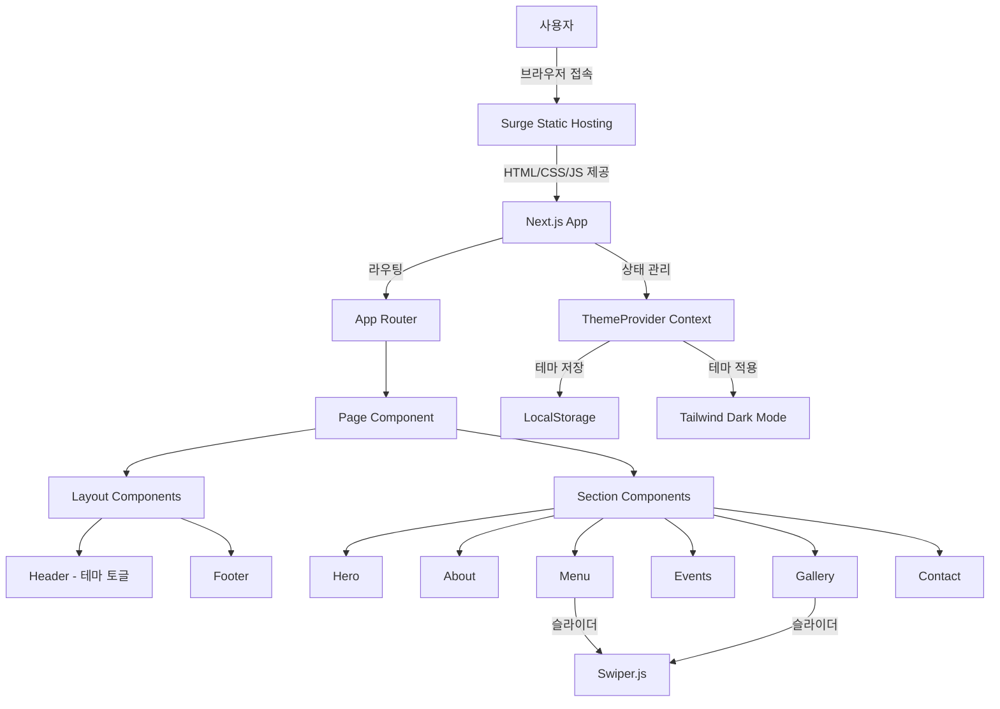
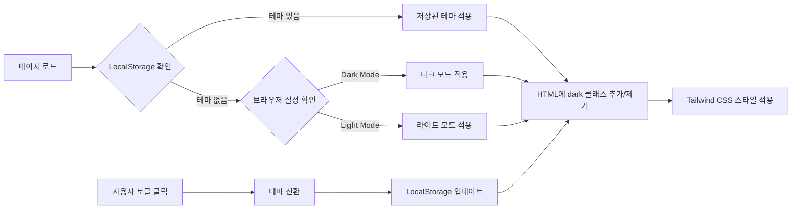
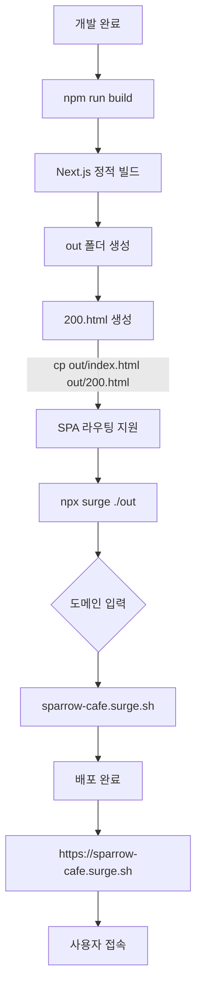
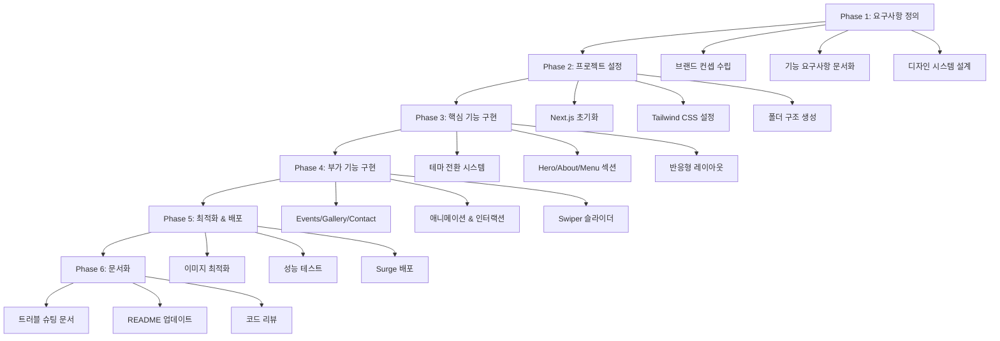

# SPARROW

> 하루에 두 번 시작되는 곳, 당신의 항해가 시작됩니다

[](https://sparrow-cafe.surge.sh)
[](https://nextjs.org/)
[](https://www.typescriptlang.org/)
[](https://tailwindcss.com/)

---

## 프로젝트 소개

**SPARROW**는 낮과 밤, 서로 다른 두 개의 세계를 품은 시간대 전환형 문화공간입니다.

햇살이 비추는 항구에서는 항해를 준비하는 선원들의 여유로운 카페가, 달빛이 내리는 바다 위에서는 모험담을 나누는 선원들의 활기찬 펍이 펼쳐집니다. 이곳에서는 당신의 하루가 두 번 시작됩니다.
> "100% Vibe Coding으로만 만들어 졌습니다."

### 프로젝트 동기

현대인들은 낮에는 휴식과 재충전을, 밤에는 사교와 문화생활을 원합니다. 하지만 대부분의 공간은 단일한 정체성만을 제공합니다. **SPARROW**는 이러한 니즈를 하나의 공간에서 해결하고자 탄생했습니다.

- **낮(Harbor)**: 바다로 나서기 전, 커피 한 잔과 함께 오늘의 계획을 세우는 항구 카페
- **밤(Voyage)**: 해가 지고, 모험담을 나누며 새로운 사람들과 연결되는 선원들의 펍

### 핵심 가치

| 키워드                    | 설명                            |
| ------------------------- | ------------------------------- |
| **Day & Night Lifestyle** | 하루에 두 번 방문하고 싶은 공간 |
| **Urban Hideout**         | 도심 속 숨은 휴식처             |
| **Culture & Lounge**      | 문화와 사교가 만나는 곳         |

---

## 주요 기능

### 다크/라이트 모드 전환

- 낮과 밤의 분위기를 완벽하게 재현하는 테마 시스템
- 자동 전환: 브라우저 테마 감지 (`prefers-color-scheme`)
- 수동 전환: 헤더의 태양☀️/달🌙 토글 버튼
- 부드러운 트랜지션 애니메이션 (0.8~1.2초)
- LocalStorage를 통한 사용자 선택 저장

### 반응형 디자인

- 모바일, 태블릿, 데스크톱 완벽 지원
- 모든 디바이스에서 최적화된 UX

### 인터랙티브 섹션

- **Hero**: 몰입감 있는 메인 비주얼과 CTA
- **About**: 브랜드 스토리와 공간 철학
- **Menu**: 낮/밤 메뉴 탭 전환
- **Events**: 특별한 이벤트 및 프로모션
- **Gallery**: 낮/밤 비교 슬라이더 (Swiper.js)
- **Contact**: 지도, 운영시간, SNS 링크

### 성능 최적화

- Next.js 14 Image 컴포넌트 활용
- Lazy Loading 적용
- WebP 이미지 포맷
- Lighthouse 성능 점수 90+

---

## 아키텍처

### 시스템 구조



### 테마 전환 플로우



### 배포 프로세스



---

## 기술 스택

### Frontend

```
Core
├─ Next.js 14.2.31      # React 프레임워크, SSR/SSG 지원
├─ React 18             # UI 라이브러리
├─ TypeScript 5         # 타입 안정성
└─ Tailwind CSS 3       # 유틸리티 CSS 프레임워크

UI/UX
├─ Framer Motion        # 애니메이션
├─ Swiper.js            # 터치 슬라이더
└─ Lucide React         # 아이콘

배포
└─ Surge                # 정적 호스팅
```

### 개발 도구

- **IDE**: Visual Studio Code
- **버전 관리**: Git
- **AI 지원**: GitHub Copilot
- **패키지 매니저**: npm

---

## 프로젝트 구조

```
SPARROW/
├── sparrow_web/              # Next.js 프로젝트 루트
│   ├── src/
│   │   ├── app/
│   │   │   ├── layout.tsx    # 루트 레이아웃
│   │   │   ├── page.tsx      # 메인 페이지
│   │   │   └── globals.css   # 글로벌 스타일
│   │   └── components/
│   │       ├── ThemeProvider.tsx  # 테마 컨텍스트
│   │       ├── layout/
│   │       │   ├── Header.tsx     # 헤더 + 테마 토글
│   │       │   └── Footer.tsx     # 푸터
│   │       └── sections/
│   │           ├── Hero.tsx       # 히어로 섹션
│   │           ├── About.tsx      # 소개 섹션
│   │           ├── Menu.tsx       # 메뉴 섹션
│   │           ├── Events.tsx     # 이벤트 섹션
│   │           ├── Gallery.tsx    # 갤러리 섹션
│   │           └── Contact.tsx    # 연락처 섹션
│   ├── public/               # 정적 파일
│   ├── package.json
│   └── tailwind.config.js
├── 요구사항정의서.md         # 프로젝트 요구사항 문서
├── 트러블슈팅.md             # 개발 중 발생한 이슈 및 해결 방법
├── 기획.txt                  # 초기 기획 문서
└── README.md                 # 프로젝트 소개 (현재 파일)
```

---

## 시작하기

### 사전 요구사항

- Node.js 18.17 이상
- npm 9 이상

### 설치 및 실행

```bash
# 저장소 클론
git clone https://github.com/yourusername/SPARROW.git
cd SPARROW/sparrow_web

# 의존성 설치
npm install

# 개발 서버 실행
npm run dev
```

개발 서버가 실행되면 브라우저에서 [http://localhost:3000](http://localhost:3000)을 열어 확인하세요.

### 빌드 및 배포

```bash
# 프로덕션 빌드
npm run build

# 프로덕션 서버 실행
npm start

# Surge 배포
npm run build
npx surge ./out sparrow-cafe.surge.sh
```

---

## 디자인 시스템

### 컬러 팔레트

#### 라이트 모드 (카페/낮)

```css
--bg-primary: #fdfcf7 /* 오프화이트 */ --bg-secondary: #b5eaea /* 스카이블루 */
  --text-primary: #3e3e3e /* 딥브라운 */ --accent: #a3b18a /* 올리브그린 */
  --accent-secondary: #e9d8a6 /* 샌드베이지 */;
```

#### 다크 모드 (펍/밤)

```css
--bg-primary: #0d1b2a /* 딥네이비 */ --bg-secondary: #1b263b /* 미드나잇블루 */
  --text-primary: #ffffff /* 화이트 */ --text-secondary: #e0a96d /* 앰버 */
  --accent: #ffd166 /* 골드 */ --accent-secondary: #3bb4c1 /* 네온블루 */;
```

### 타이포그래피

- **헤드라인**: Playfair Display (Serif) - 항구 간판과 항해 일지 감성
- **본문**: Pretendard / Noto Sans KR - 가독성과 현대성

---

## 담당 기능

> **1인 풀스택 개발**로 진행된 프로젝트입니다.

### 개발 범위

- [x] 프로젝트 기획 및 요구사항 정의
- [x] UI/UX 디자인 시스템 설계
- [x] Next.js 프로젝트 구조 설계
- [x] 다크/라이트 모드 전환 시스템 구현
- [x] 모든 섹션 컴포넌트 개발
- [x] 반응형 레이아웃 구현
- [x] 애니메이션 & 인터랙션 구현
- [x] 성능 최적화
- [x] Surge 배포

### 기술적 구현 사항

1. **테마 시스템**: React Context API + LocalStorage
2. **애니메이션**: Framer Motion을 활용한 부드러운 전환
3. **슬라이더**: Swiper.js 커스터마이징
4. **반응형**: Tailwind CSS 브레이크포인트 활용
5. **이미지 최적화**: Next.js Image 컴포넌트

---

## 트러블 슈팅

자세한 내용은 [트러블슈팅.md](./트러블슈팅.md)를 참고하세요.

### 주요 해결 이슈

1. **테마 전환 시 깜빡임 현상**: LocalStorage 초기값 로딩 최적화
2. **Swiper 슬라이더 CSS 미적용**: CSS 파일 import 추가
3. **Surge 배포 시 404 에러**: 200.html 파일 생성으로 SPA 라우팅 지원
4. **이미지 최적화 이슈**: Next.js 정적 export 설정 조정

---

## 개발 프로세스



### Phase 1: 요구사항 정의 (1일차)

- 브랜드 컨셉 및 스토리 수립
- 기능 요구사항 문서화
- 디자인 시스템 설계

### Phase 2: 프로젝트 설정 (2일차)

- Next.js 프로젝트 초기화
- Tailwind CSS, TypeScript 설정
- 폴더 구조 및 컴포넌트 설계

### Phase 3: 핵심 기능 구현 (3-4일차)

- 테마 전환 시스템
- Hero, About, Menu 섹션
- 반응형 레이아웃

### Phase 4: 부가 기능 구현 (5일차)

- Events, Gallery, Contact 섹션
- 애니메이션 & 인터랙션
- Swiper 슬라이더

### Phase 5: 최적화 & 배포 (6일차)

- 이미지 최적화
- 성능 테스트
- Surge 배포 및 설정

### Phase 6: 문서화 (7일차)

- 트러블 슈팅 문서 작성
- README 업데이트
- 코드 리뷰 및 정리

---

## 학습 성과

이 프로젝트를 통해 다음을 학습하고 경험했습니다:

### 기술적 성장

- Next.js 14 App Router 심화
- TypeScript 실전 활용
- React Context API를 활용한 전역 상태 관리
- Tailwind CSS 고급 기법
- Framer Motion 애니메이션 구현
- 웹 성능 최적화 기법

### 프로세스 경험

- 1인 풀스택 프로젝트 완수
- 기획부터 배포까지 전 과정 경험
- GitHub Copilot을 활용한 생산성 향상
- Surge를 통한 정적 사이트 배포 프로세스
- 트러블 슈팅 및 문제 해결 능력

### 디자인 사고

- 브랜드 아이덴티티 설계
- 사용자 경험 중심 설계
- 반응형 디자인 패턴
- 접근성 고려

---

## 향후 계획

### Phase 2 (예정)

- [ ] 예약 시스템 구현 (백엔드 연동)
- [ ] 관리자 대시보드
- [ ] 이벤트 관리 CMS
- [ ] 다국어 지원 (i18n)

### Phase 3 (예정)

- [ ] PWA 전환
- [ ] 오프라인 지원
- [ ] 푸시 알림
- [ ] 소셜 로그인

---

## 라이선스

이 프로젝트는 개인 포트폴리오 목적으로 제작되었습니다.

---

## 개발자

**Ipang**

- Portfolio: [작성 예정]
- GitHub: [@paaaaang](https://github.com/paaaaang)
- Email: [이메일 주소]

---

## 감사의 말

이 프로젝트는 VSCode 환경에서 GitHub Copilot의 도움을 받아 개발되었습니다.
실제 서비스 구현은 미비하지만, 웹 서비스 기획부터 배포까지 전체 프로세스를 경험하며
많은 것을 배울 수 있었습니다.

---

<div align="center">

**당신의 하루가 두 번 시작되는 곳, SPARROW**

[Live Demo](https://sparrow-cafe.surge.sh) | [요구사항 정의서](./요구사항정의서.md) | [기획서](./기획.txt)

</div>
